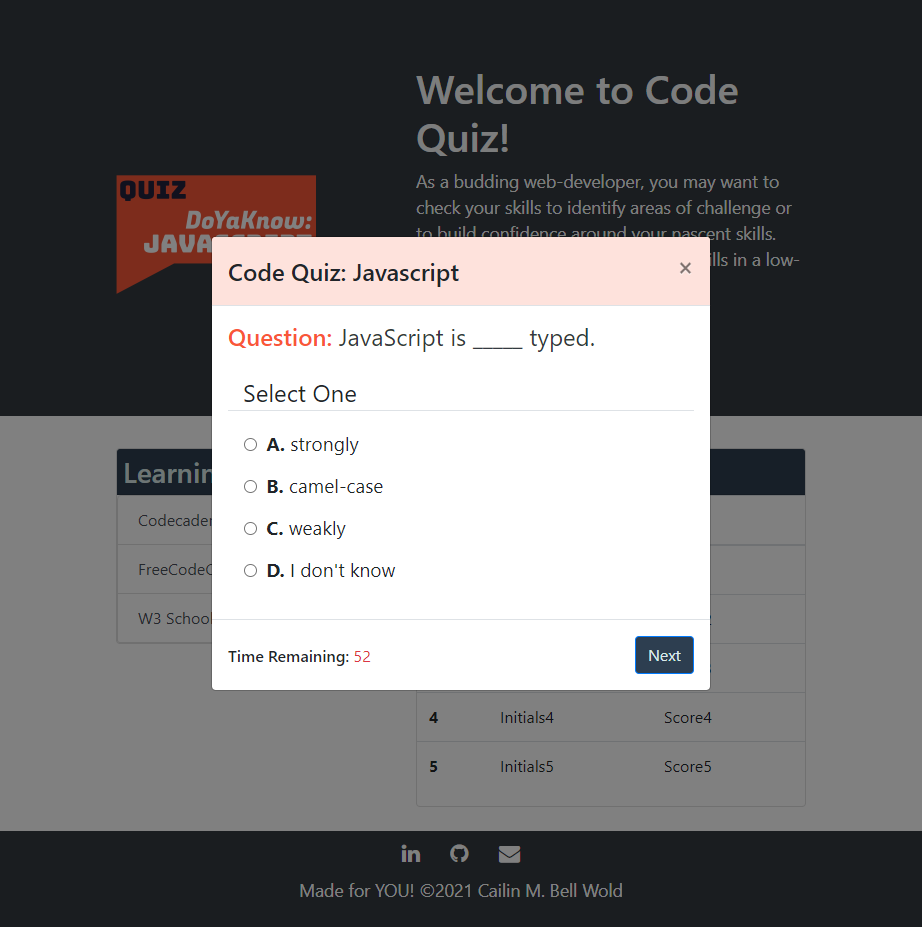

# 04 Code Quiz

## Description

Create a **deployed** and **functional code quiz** by writing JavaScript that runs a timer, presents users with multiple-choice questions, tallies a score and stores high-scores.

### Motivation
This project offered the opportunity to think about how multiple elements work together to create a more comprehensive program than we had, thusfar. Using a Bootstrap modal, timer, question array and storing scores to local storage presented a level of complexity not previously encountered and the challenges that go along with it. It especially called on skills associated with breaking a larger puzzle down into smaller peices, and with managing stress when new skills were put to the test.

### Learning Targets
This exercise encompassed building a JavaScript page using Bootstrap, increasing familiarity with setTimeout() and setInterval() functions, traversing the DOM to update elements as the quiz progressed, and passing items into and out of local storage.

## Core Objectives Met

1. When the "Let's Begin" button is clicked, a timer starts and the user is presented with a question.
2. When the user answers a question, they are presented with another question.
3. If a user answers a question incorrectly, time is subtracted from the clock.
4. When all questions are answered or the timer reaches zero, the quiz is over.
5. When the quiz is over, the user can save their initials and score.

## Screen Shot

 

## Deployed Application

https://cailinbellwold.github.io/Code-Quiz/

## MIT License
&copy;2021 Cailin Bell Wold

Permission is hereby granted, free of charge, to any person obtaining a copy
of this software and associated documentation files (the "Software"), to deal
in the Software without restriction, including without limitation the rights
to use, copy, modify, merge, publish, distribute, sublicense, and/or sell
copies of the Software, and to permit persons to whom the Software is
furnished to do so, subject to the following conditions:

The above copyright notice and this permission notice shall be included in all
copies or substantial portions of the Software.

THE SOFTWARE IS PROVIDED "AS IS", WITHOUT WARRANTY OF ANY KIND, EXPRESS OR
IMPLIED, INCLUDING BUT NOT LIMITED TO THE WARRANTIES OF MERCHANTABILITY,
FITNESS FOR A PARTICULAR PURPOSE AND NONINFRINGEMENT. IN NO EVENT SHALL THE
AUTHORS OR COPYRIGHT HOLDERS BE LIABLE FOR ANY CLAIM, DAMAGES OR OTHER
LIABILITY, WHETHER IN AN ACTION OF CONTRACT, TORT OR OTHERWISE, ARISING FROM,
OUT OF OR IN CONNECTION WITH THE SOFTWARE OR THE USE OR OTHER DEALINGS IN THE
SOFTWARE.

## Contact
For inquiries, please contact contributor [Cailin Bell Wold](https://github.com/CailinBellWold).
